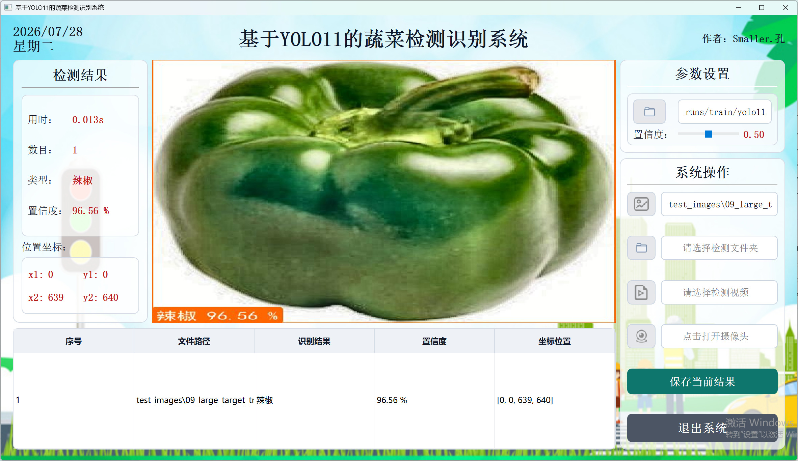
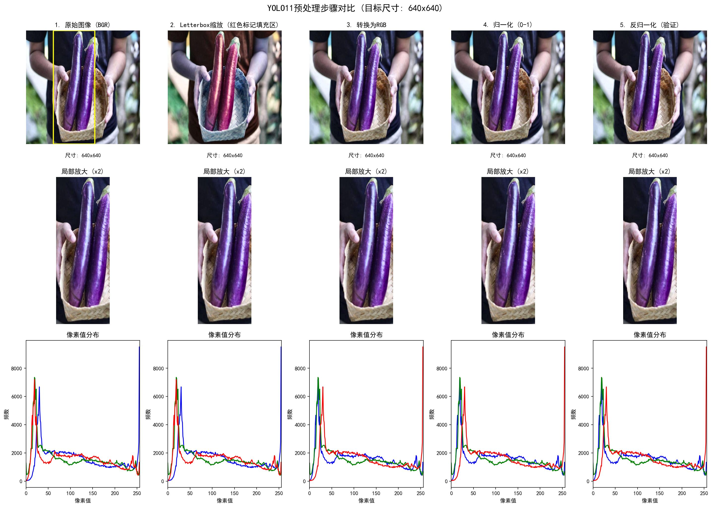
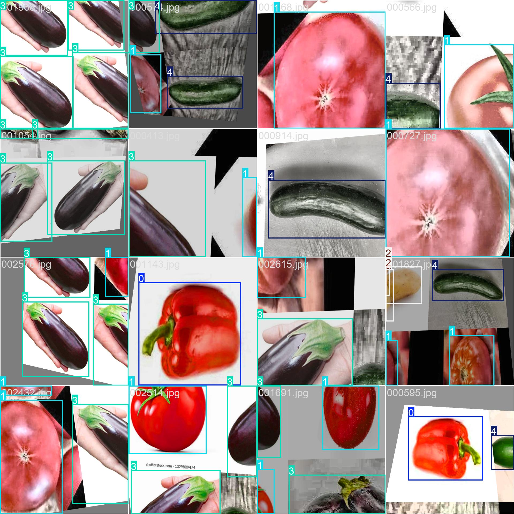
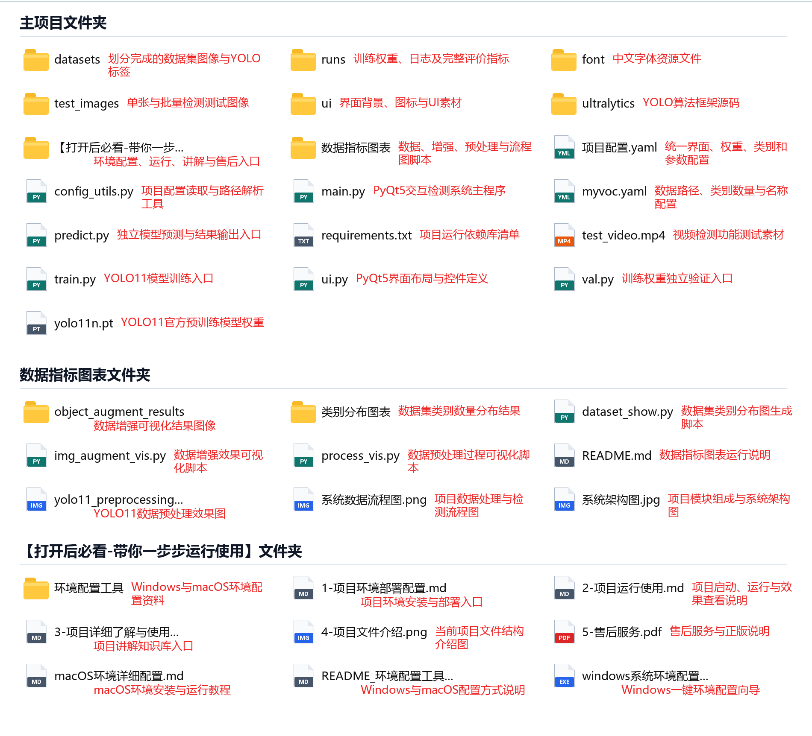
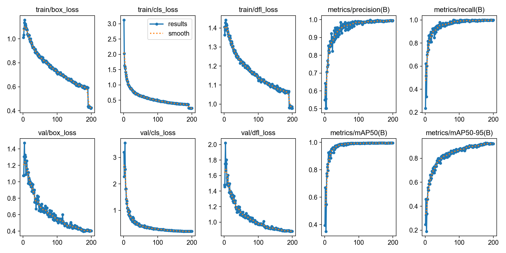
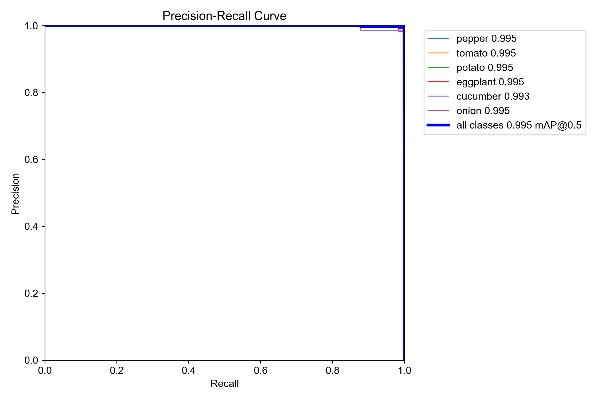
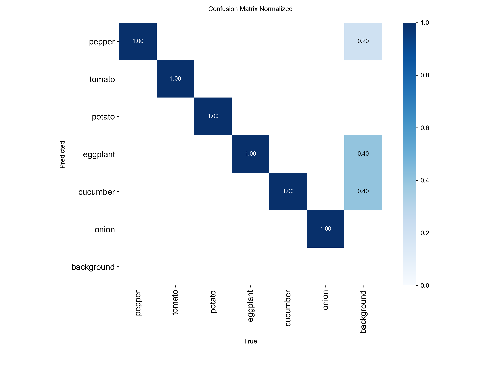
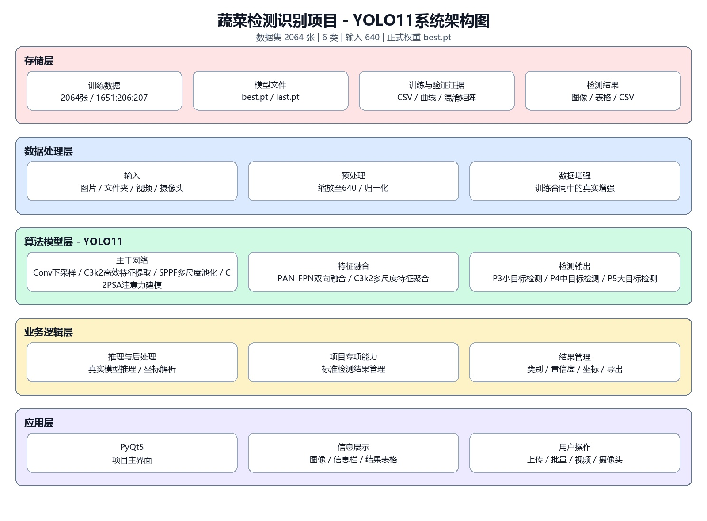
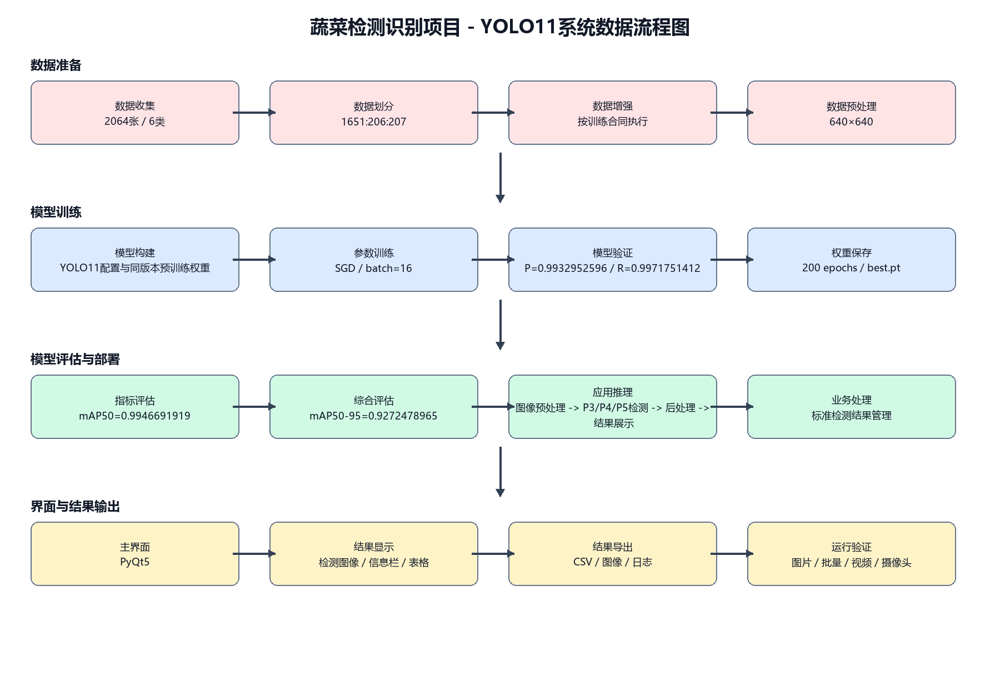

# YOLO多版本蔬菜检测识别系统（PyQt5）

一个面向课程设计、毕业设计和目标检测学习的中文项目说明。项目基于同一套六类蔬菜数据，提供**YOLOv8、YOLO11、YOLO26三个独立版本**，并包含训练、验证、预测、PyQt5界面和CSV结果保存流程。

## 运行效果

支持**单张图片、文件夹批量、视频和摄像头输入**。界面显示检测框、中文类别、置信度与坐标，下方表格用于汇总结果。




运行视频：https://www.bilibili.com/video/BV1jJYM6MEtr/

视频使用YOLO11版演示；YOLOv8与YOLO26保留相同的主要界面流程，各自加载对应权重。

## 功能

- 单张图片蔬菜目标检测
- 文件夹批量图片检测
- 视频逐帧检测
- 摄像头实时检测
- 检测框、类别、置信度与坐标显示
- 表格汇总与CSV保存
- 独立训练、验证与预测入口
- YOLOv8、YOLO11、YOLO26三版本结果对照

## 数据集

共**2064张图像**，包含六类蔬菜。

| ID | English | 中文 |
|---:|---|---|
| 0 | pepper | 辣椒 |
| 1 | tomato | 番茄 |
| 2 | potato | 土豆 |
| 3 | eggplant | 茄子 |
| 4 | cucumber | 黄瓜 |
| 5 | onion | 洋葱 |

| Split | Images |
|---|---:|
| train | 1651 |
| val | 206 |
| test | 207 |

```yaml
train: ./datasets/dataset/images/train
val: ./datasets/dataset/images/val
test: ./datasets/dataset/images/test
nc: 6
names: [pepper, tomato, potato, eggplant, cucumber, onion]
```





## 目录结构



```text
project/
├── main.py                    # PyQt5检测主程序
├── ui.py                      # 界面布局与控件
├── train.py                   # 模型训练
├── val.py                     # 独立验证
├── predict.py                 # 独立预测
├── config_utils.py            # 配置读取
├── 项目配置.yaml               # 权重、阈值、标题、类别
├── myvoc.yaml                 # 数据集路径与类别
├── requirements.txt
├── datasets/
│   └── dataset/
│       ├── images/{train,val,test}/
│       └── labels/{train,val,test}/
├── runs/                      # 权重、参数、CSV、曲线
├── test_images/
├── test_video.mp4
└── 数据指标图表/
```

## 环境与启动

项目资料按Python 3.11环境整理。每个版本都是独立目录，进入所选版本后安装依赖。

```bash
conda create -n vegetable-yolo python=3.11 -y
conda activate vegetable-yolo
pip install -r requirements.txt
python main.py
```

启动前检查`项目配置.yaml`中的权重相对路径。YOLO11默认配置示例：

```yaml
model:
  name: YOLO11基础版
  algorithm: YOLO11
  weights: runs/train/yolo11_vegetable_detection/weights/best.pt
  conf: 0.5
  iou: 0.5
```

加载现成权重完成图片或视频演示可在普通电脑运行；重新训练建议使用NVIDIA GPU。

## 训练配置

三个版本使用同一数据划分并**完成200轮训练**。

```python
epochs = 200
imgsz = 640
batch = 16
optimizer = "SGD"
lr0 = 0.01
seed = 42
mosaic = 1.0
close_mosaic = 10
```

训练产物保存在`runs/train/.../`，包括：

- `weights/best.pt`
- `weights/last.pt`
- `args.yaml`
- `results.csv`
- `results.png`
- PR、F1、P、R曲线与混淆矩阵
- 训练/验证批次可视化



## 独立验证结果

下表来自三个版本各自的`evaluation_metrics.json`。

| Version | Precision | Recall | mAP50 | mAP50-95 |
|---|---:|---:|---:|---:|
| YOLOv8 | 0.9861 | 0.9974 | 0.9919 | 0.8878 |
| YOLO11 | 0.9933 | 0.9972 | 0.9947 | 0.9272 |
| YOLO26 | 0.9892 | 0.9976 | 0.9945 | 0.9357 |

**YOLO11的Precision和mAP50略高；YOLO26的Recall和mAP50-95略高。**请按任务书要求与实验重点选择版本，不要把任一版本的指标当作三个版本的共同结果。





## 系统流程





```text
Image / Folder / Video / Camera
              ↓
Letterbox + BGR→RGB + Normalize
              ↓
YOLO best.pt inference
              ↓
Class / Confidence / Box parsing
              ↓
PyQt5 image + information + table
              ↓
CSV export
```

## 版本选择

| 版本 | 建议使用场景 |
|---|---|
| YOLOv8 | 任务书明确指定YOLOv8，或希望从资料较多的版本入手 |
| YOLO11 | 与当前运行视频对应，适合按本文结构理解训练与界面 |
| YOLO26 | 任务指定YOLO26，或需要在同一数据集上做多版本比较 |

## 已知边界

- 当前任务是目标检测，输出类别与检测框，不是实例分割。
- 界面提供本地图片、批量、视频、摄像头与CSV功能。
- 数据库、登录系统、云端API和嵌入式部署不在当前代码范围内。
- 界面截图中的单图置信度不等同于验证集Precision、Recall或mAP。

## 如何复核项目

建议按下面的顺序检查，而不是只运行一次界面：

1. 打开`myvoc.yaml`，确认数据路径、`nc: 6`和六个类别名称；再抽查`datasets/dataset/labels`中的同名TXT标签。
2. 查看当前版本`runs/train/.../args.yaml`与`results.csv`，核对200轮训练、640输入尺寸、batch 16、SGD和初始学习率0.01。
3. 在`runs/val/.../evaluation_metrics.json`中复核表格中的Precision、Recall、mAP50和mAP50-95，三个版本要分别核对。
4. 检查`项目配置.yaml`指向的`best.pt`是否属于当前版本，再运行`python main.py`测试单图、批量、视频、摄像头和CSV保存。

这条检查链把数据配置、训练记录、验证结果、模型权重和界面入口一一对应起来。更换自己的数据或权重时，也应该沿着同一顺序修改和验证，避免只替换`best.pt`却遗漏类别名称、阈值或数据配置。

## 项目代码获取

项目代码与完整资料：https://smallerkong.com/s/gh-yolov8-shuca-74f0c0

